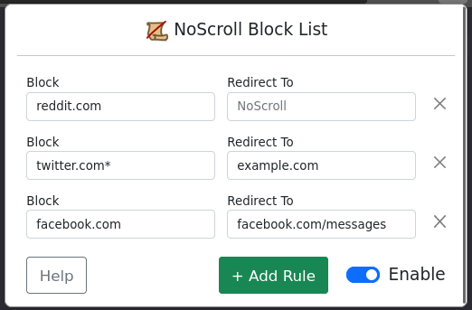

# NoScroll Extension

Stop endless scrolling and take control of your online habits with the NoScroll extension.
Block rules are intentionally simple and flexible so you're in control. Quickly enable/disable your rules so <em>you</em> can decide when it's time to focus.



## Features

- **Simple Unlimited Ruleset:** Create rules to block or redirect specific websites or pages
- **Flexibility:** Block a single page, or block a whole site
- **Focus Mode:** Enable and disable rules on-demand for ultimate control over your browsing experience

## Installation

Install the extension from [Mozilla Add-ons](#) (coming soon)

##### Manual Installation / Development

Download and unzip the project, then type `about:debugging` in your address bar in Firefox. 
Under "This Firefox", find "Load Temporary Add-on" and load the `manifest.json` file.

## Usage

1. Click on the NoScroll icon (reccomended to pin to toolbar for easy access).

2. Add or modify rules in the popup window. Ex:

    - The following ruleset will block the <strong>homepage</strong> of Facebook, so you don't spend your time infinitely scrolling. <br> Still want to keep in touch with friends? Set it to redirect to your messages!
        ```plaintext
        Block: facebook.com
        Redirect: facebook.com/messages
        ```

    - Want to block a <strong>whole</strong> website? <br> Add the wildcard <strong>*</strong> at the end of your block rule so nothing gets through!
        ```plaintext
        Block: facebook.com*
        Redirect: youtube.com/watch?v=dQw4w9WgXcQ
        ```

3. Your rules are saved automatically when you exit.

4. Need to concentrate? Toggle "enabled". Break time? Toggle it off!


## Contributing

Contributions are welcome! If you find a bug or have a feature request, please [open an issue](https://github.com/Seltonu/NoScroll/issues).

*Note that NoScroll is designed to be intentionally simple, if you need complex rulesets please check out an extension like LeechBlock NG.*

## License

This project is licensed under the [MIT License](LICENSE).

## Acknowledgements

- [Bootstrap](https://getbootstrap.com/) - Front-end framework for styling.


